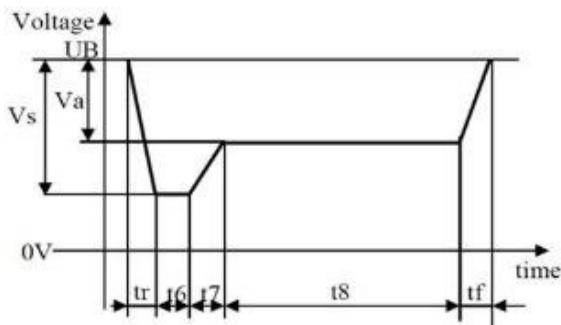

# 全体要件

# 1. テストスペック

テストスペック49245-1528を満足すること

# 2. 最低動作電圧

<table><tr><td>最低動作電圧</td><td>7.5 [V]</td></tr></table>

注）上記電圧以下も、法規で表示が義務付けられている機能項目については、通常動作が可能な限り通常動作すること通常動作ができない電圧まで入力電圧が低下した場合は、原則IG-OFF時と同じ動作をすることバッテリ警告表示は「バッテリ警告」に既定の条件に従うこと

# 3. 暗電流

<table><tr><td>任意リーナイズOFF時</td><td>0.8 [mA] (MAX) at 13 [V] (TYP 0.6 [mA] at 13 [V])</td></tr><tr><td>任意リーナイズON時</td><td>6.25 [mA] × 24 [hr] = 150 [mAh] 以下</td></tr></table>

# 4. CAN終端抵抗

<table><tr><td>終端抵抗</td><td>124 [Ω] ±1 [%]</td></tr></table>

# 5. バッテリ瞬断

バッテリ瞬断時の挙動を評価する際は、下記波形を適用すること

引用規格: JASO D007-98 8.1.4

電圧波形:

$$
\begin{array}{l} \mathrm {U B} = 1 2 \mathrm {V} \\ V a = - 5. 7 V \\ V S = - 7 V \\ \mathrm {t r} = 5 \mathrm {m s} \\ t 6 = 1 5 \mathrm {m s} \text {a n d} 4 0 \mathrm {m s} \\ t 7 = 5 0 m s \\ t 8 = 0. 5 s a n d 2 0 s \\ \end{array}
$$

ただし、上記波形に限らず、バッテリ瞬断発生時にEEPROM保存内容が書き換えられないこと